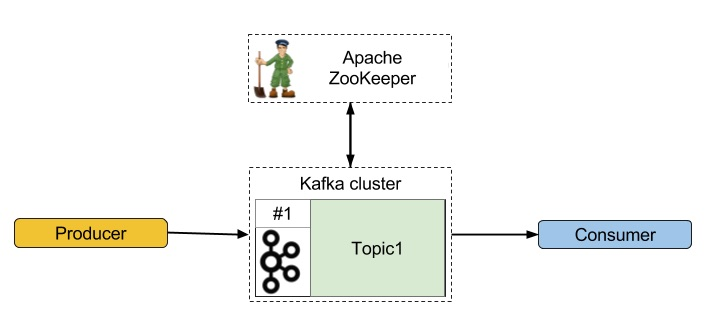

## How to start the kafka broker
``
docker-compose up 
``

## How to stop kafka broker 
``
docker-compose down 
``

`localhost:9092`

**Apache Kafka** is an open-source distributed event streaming platform used by thousands of companies for high-performance data pipelines, streaming analytics, data integration, and mission-critical applications.

## Zookeeper:
 
Apache ZooKeeper plays the very important role in system architecture as it works in the shadow of more exposed Big Data tools, as Apache Spark or Apache Kafka. In other words, Apache Zookeeper is a distributed, open-source configuration, synchronization service along with naming registry for distributed applications.
#### ZooKeeper in Kafka Broker:
#### i. State
Zookeeper determines the state. That means, it notices, if the Kafka Broker is alive, always when it regularly sends heartbeats requests. Also, while the Broker is the constraint to handle replication, it must be able to follow replication needs.
#### ii. Quotas
In order to have different producing and consuming quotas, Kafka Broker allows some clients. This value is set in ZK under /config/clients path. Also, we can change it in bin/kafka-configs.sh script.
#### iii. Replicas
However, for each topic, Zookeeper in Kafka keeps a set of in-sync replicas (ISR). Moreover, if somehow previously selected leader node fails then on the basis of currently live nodes Apache ZooKeeper will elect the new leader.
Have a look at Apache Kafka Career Scope with Salary trends
#### iv. Nodes and Topics Registry
Basically, Zookeeper in Kafka stores nodes and topic registries. It is possible to find there all available brokers in Kafka and, more precisely, which Kafka topics are held by each broker, under /brokers/ids and /brokers/topics zNodes, they’re stored. In addition, when it’s started, Kafka broker create the register automatically.

#### b. Kafka Consumers
#### i. Offsets
ZooKeeper is the default storage engine, for consumer offsets, in Kafka’s 0.9.1 release. However, all information about how many messages Kafka consumer consumes by each consumer is stored in ZooKeeper.
#### ii. Registry
Consumers in Kafka also have their own registry as in the case of Kafka Brokers. However, same rules apply to it, ie. as ephemeral zNode, it’s destroyed once consumer goes down and the registration process is made automatically by the consumer.
## Kafka Broker:
Kafka cluster typically consists of multiple brokers to maintain load balance. Kafka brokers are stateless, so they use ZooKeeper for maintaining their cluster state. One Kafka broker instance can handle hundreds of thousands of reads and writes per second and each bro-ker can handle TB of messages without performance impact. Kafka broker leader election can be done by ZooKeeper.

